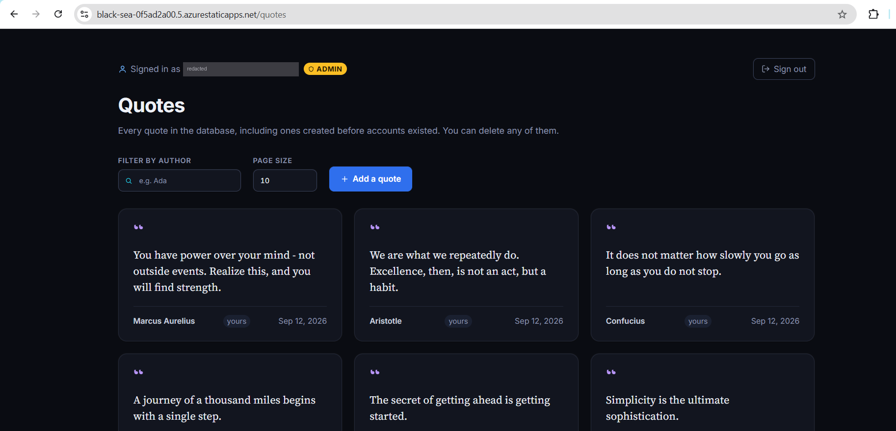

# Demo

Two things to show, and they are different kinds of thing: a deployed
application, and a design.

Everything below is captured output from 18 September 2026, not an illustration
of what the output would look like.

---

## 1. The live application

**Open this:** <https://black-sea-0f5ad2a00.5.azurestaticapps.net>

That is the whole public surface. The API sits behind it at `/api/*` as a
linked Container App backend, which means the API's own hostname answers 401 to
everything on purpose — see [DEPLOYMENT.md](DEPLOYMENT.md) for why, and for why
`x-ms-middleware-request-id` in a 401's headers is how you tell the gateway
apart from the application.



Signed in at `/quotes`, and there is more in that screenshot than a list of
quotes. The `ADMIN` badge is a role claim on a JWT the API minted, resolved
against `Auth__AdminEmails__0` in the deployed container's environment — so
the identity chain works end to end: register or sign in against Azure SQL,
token issued, token validated, role read from configuration rather than from
the request, and the UI showing a control it only shows to an admin. Each
`yours` tag is the same principal compared against a quote's owner.

The email address is masked. It is the only piece of personal data on the page
and a screenshot committed to a repository is a shareable artefact, so it is
redacted rather than left for whoever clones this next.

### The part worth watching: a security fix shipping

At 05:05 the public front door returned every collection in the database to
anyone who asked.

```
$ curl -i https://black-sea-0f5ad2a00.5.azurestaticapps.net/api/collections
HTTP/1.1 200 OK
Content-Length: 2
Content-Type: application/json; charset=utf-8
...
[]
```

`200`, not `401`. `CollectionsController` carried no `[Authorize]` attribute on
the class or on any of its seven actions, and `AddAuthorization()` has no
fallback policy — so the controller was anonymous, including
`DELETE /api/collections/{id}/items/{quoteId}` and the `GET` above that returns
everything. The empty array is because that database holds no collections. That
is luck, not protection.

The same request, one revision later:

```
collections  401
summaries    401
quotes       401
ui root      200
```

```json
[ { "healthy": "Healthy", "name": "quotes-api-dev--0000005", "traffic": 100 } ]
```

Image `crquotes33928.azurecr.io/quotes-api:0.3.0`.

`quotes` was 401 before and after, and that contrast is the diagnosis: the
minimal-API quotes group carries `RequireAuthorization()` at group level, so
anything added to it is protected by default. The controller is the one piece of
the app registered a different way, and it inherited none of that.

**How it was proven before it was fixed.** Not by writing to production — by
landing the assertion first and watching it fail against a throwaway SQL Server
container:

```
Expected (anonymous.GetAsync("/api/collections")).StatusCode to be
HttpStatusCode.Unauthorized {value: 401} because GET / returns every collection
in the database, but found HttpStatusCode.OK {value: 200}.
```

Then `[Authorize]` on the class, and the full suite: **56 tests, 56 passing.**
None of the existing collections tests had to change, because every one of them
already arrived carrying a token — which is exactly why nobody noticed the hole
for seven days. A suite where every caller is authenticated cannot tell a
protected endpoint from an unprotected one.

The follow-up that is *not* fixed is recorded as a test rather than a comment:
`Collections_StillLetOneSignedInUserSeeAnothersData_KnownGap`. Ownership is
still `ownerId` from the query string, so one signed-in user can still read
another's collections.

---

## 2. The capstone: one publish, end to end

Re-runnable: [`capstone/demo/walkthrough.ps1`](capstone/demo/walkthrough.ps1).
Start the API with a deliberately slow relay first —
`$env:Relay__PollIntervalMilliseconds="10000"` — because the single most
important thing here is one database row in two states, and at the default 250ms
that transition cannot be seen by hand. Day 30 only caught it by accident inside
a 325ms window.

```
== 2. alice starts a collection (id minted by the domain, not the database)
{ "collectionId": "01a0b2fe-2cf8-792c-a682-df79d87641f5" }

== 3a. first quote added        { "items": 1 }
== 3b. second quote added       { "items": 2 }

== 4. bob's feed before publishing
[]  (empty)

== 5. publish - returns on commit, not on delivery
{ "published": true }
```

The response says `published: true` and nothing about delivery. That is a
design decision that was reversed once and put back: an earlier version drained
the relay inline and returned a delivered count, which put another module's
availability on the publish path and made publish latency a function of
follower count. Both are what the outbox exists to prevent.

**The two observations this walkthrough exists for:**

```
== 6. the outbox, immediately: the announcement is durable and undelivered
{
    "messageId":  "01a0b2fe-2ed4-7c9f-973b-e079891e1e02",
    "eventType":  "curation.collection.published.v1",
    "occurredAt": "2026-09-18T05:29:57.7095178+00:00",
    "sentAt":     null,
    "delivered":  false
}

== 7. bob's feed, immediately: still empty - eventually consistent by design
[]  (empty)
```

The collection is published and the announcement is committed, in the same
transaction, and nobody has delivered it. A reader who queries the feed the
instant publish returns and sees nothing is being shown the design.

```
== 9. the same row, acknowledged - nothing was deleted, SentAt was stamped
{
    "messageId":  "01a0b2fe-2ed4-7c9f-973b-e079891e1e02",
    "eventType":  "curation.collection.published.v1",
    "occurredAt": "2026-09-18T05:29:57.7095178+00:00",
    "sentAt":     "2026-09-18T05:30:03.7674999+00:00",
    "delivered":  true
}
```

Same `messageId`. Same `occurredAt`. Nothing was dequeued or deleted — `SentAt`
was stamped, and only after a subscriber accepted the message. That is the
difference between claiming at-least-once delivery and providing it: a handler
that throws leaves the row exactly as it was, and the next poll finds it again.

6.06 seconds from commit to acknowledgement. The previous run of this same
script, unchanged, took 466ms. The delay is wherever the publish lands in the
poll cycle, and subscribers are promised nothing about it.

```
== 10a. bob's feed
{ "collectionId": "01a0b2fe-2cf8-792c-a682-df79d87641f5",
  "curatorId": "alice", "name": "Distributed Systems Wisdom",
  "publishedAt": "2026-09-18T05:29:57.7095178+00:00" }

== 10b. carol's feed - fan-out on write means one entry each
{ ...the same entry... }
```

Two followers, two entries, written by a subscriber in a different module that
received only the serialised integration event — no domain object, no shared
memory, a message it had to deduplicate itself. Anything that works here works
over a broker, which is what day 3 of the build plan replaces this with.

```
== 11. publishing again
400, with the domain's own sentence:
{"error":"This collection is already published."}

== 12. and still exactly one outbox row
```

Step 12 is the half that matters. The aggregate refusing a second publish is a
rule; staging no second announcement is what stops a duplicate card appearing in
every follower's feed.

---

## What this demo does not show

The capstone is not deployed. Two of its three modules keep their state in
process memory, so a restart loses `alice`'s followers while keeping the outbox
row addressed to them. The relay reads a table in the same process rather than a
broker, and caps at 80 messages a second. All of it is in
[STATUS.md](STATUS.md) with numbers.

The honest summary of the two halves: the deployed application is a real
application with a real security fix shipped today; the capstone is a correct
design, tested at four layers, that has never run anywhere but a laptop.
