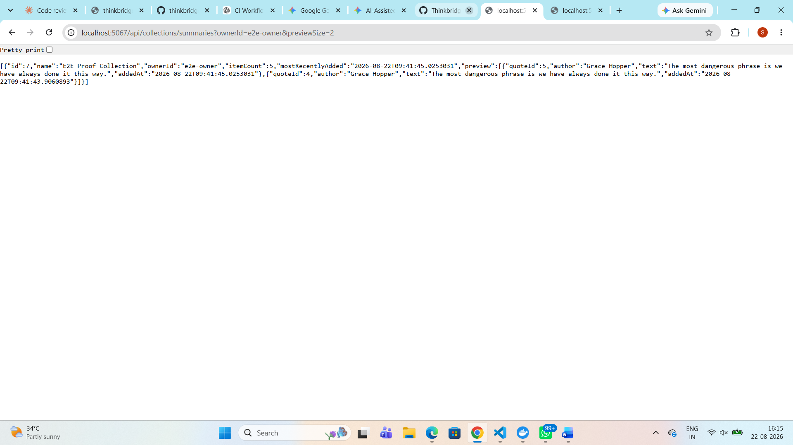
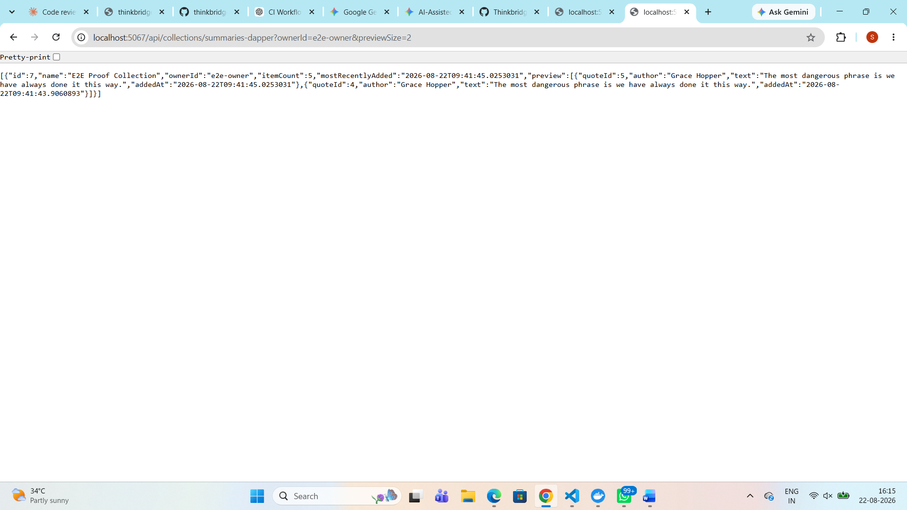

# Dapper vs EF — Collections summaries read path

Two handlers answer the same question — "give me this owner's collections,
each with an item count, the most recent add time, and a capped preview" —
one through EF's LINQ projection, one through hand-written SQL via Dapper.
Both are wired up on the controller so they can be called side by side:

- `GET /api/collections/summaries` → `GetCollectionSummariesHandler` (EF, unchanged baseline)
- `GET /api/collections/summaries-dapper` → `GetCollectionSummariesDapperHandler` (Dapper)

Both return the same `IReadOnlyList<CollectionSummary>` — verified below to be
byte-identical for the same input, not just similar.

## The two handlers, side by side

**EF** ([GetCollectionSummaries.cs](GetCollectionSummaries.cs)) — a LINQ projection lets EF
build the SQL, including the window function, from the shape of the `Select`:

```csharp
var collections = await db.Collections
    .AsNoTracking()
    .Where(c => request.OwnerId == null || c.OwnerId == request.OwnerId)
    .Select(c => new
    {
        c.Id,
        c.Name,
        c.OwnerId,
        ItemCount = c.Items.Count,
        MostRecentlyAdded = c.Items.Count == 0 ? (DateTime?)null : c.Items.Max(i => i.AddedAt),
        PreviewItems = c.Items
            .OrderByDescending(i => i.AddedAt)
            .Take(request.PreviewSize)
            .Select(i => new { i.QuoteId, i.AddedAt })
            .ToList()
    })
    .ToListAsync(ct);

// second query: fetch only the quotes that appear in a preview
var quotes = await db.Quotes
    .AsNoTracking()
    .Where(q => quoteIds.Contains(q.Id))
    .Select(q => new { q.Id, q.Author, q.Text })
    .ToDictionaryAsync(q => q.Id, ct);
```

**Dapper** ([GetCollectionSummariesDapper.cs](GetCollectionSummariesDapper.cs)) — the same two
queries, but the SQL is written by hand and the row-to-object shaping happens
in code instead of inside the LINQ translator:

```csharp
var rows = (await connection.QueryAsync<CollectionRow>(new CommandDefinition(
    CollectionsSql,
    new { request.OwnerId, request.PreviewSize },
    cancellationToken: ct))).ToList();

var quotes = quoteIds.Count == 0
    ? new Dictionary<int, QuoteRow>()
    : (await connection.QueryAsync<QuoteRow>(new CommandDefinition(
        QuotesSql, new { QuoteIds = quoteIds }, cancellationToken: ct)))
        .ToDictionary(q => q.Id);

return rows
    .GroupBy(r => r.Id)
    .Select(g => /* build CollectionSummary + preview list from the group */)
    .ToList();
```

It reuses the EF-managed connection (`db.Database.GetDbConnection()`) instead
of opening a second one, so both handlers share one pooled SQLite connection.
Both queries are fully parameterised (`@OwnerId`, `@PreviewSize`, `@QuoteIds`)
— no string concatenation of request input.

## The SQL: EF-generated vs hand-written

EF's generated SQL (captured in [../../docs/day12-runtime-evidence.md](../../docs/day12-runtime-evidence.md),
reproduced by the live server in this exercise):

```sql
SELECT "c"."Id", "c"."Name", "c"."OwnerId", (
    SELECT COUNT(*)
    FROM "CollectionItem" AS "c0"
    WHERE "c"."Id" = "c0"."CollectionId"), CASE
    WHEN (
        SELECT COUNT(*)
        FROM "CollectionItem" AS "c1"
        WHERE "c"."Id" = "c1"."CollectionId") = 0 THEN NULL
    ELSE (
        SELECT MAX("c2"."AddedAt")
        FROM "CollectionItem" AS "c2"
        WHERE "c"."Id" = "c2"."CollectionId")
END, "c5"."QuoteId", "c5"."AddedAt", "c5"."Id"
FROM "Collections" AS "c"
LEFT JOIN (
    SELECT "c4"."QuoteId", "c4"."AddedAt", "c4"."Id", "c4"."CollectionId"
    FROM (
        SELECT "c3"."QuoteId", "c3"."AddedAt", "c3"."Id", "c3"."CollectionId", ROW_NUMBER() OVER(PARTITION BY "c3"."CollectionId" ORDER BY "c3"."AddedAt" DESC) AS "row"
        FROM "CollectionItem" AS "c3"
    ) AS "c4"
    WHERE "c4"."row" <= @request_PreviewSize
) AS "c5" ON "c"."Id" = "c5"."CollectionId"
WHERE "c"."OwnerId" = @request_OwnerId
ORDER BY "c"."Id", "c5"."CollectionId", "c5"."AddedAt" DESC
```

Hand-written SQL used by the Dapper handler — same job, expressed with a
`GROUP BY` for the unfiltered count/max instead of correlated subqueries, and
the same `ROW_NUMBER()` window for the capped preview:

```sql
SELECT c."Id"      AS Id,
       c."Name"    AS Name,
       c."OwnerId" AS OwnerId,
       COALESCE(agg."ItemCount", 0) AS ItemCount,
       agg."MostRecentlyAdded"      AS MostRecentlyAdded,
       p."QuoteId" AS PreviewQuoteId,
       p."AddedAt" AS PreviewAddedAt
FROM "Collections" AS c
LEFT JOIN (
    SELECT "CollectionId",
           COUNT(*)       AS "ItemCount",
           MAX("AddedAt") AS "MostRecentlyAdded"
    FROM "CollectionItem"
    GROUP BY "CollectionId"
) AS agg ON agg."CollectionId" = c."Id"
LEFT JOIN (
    SELECT "CollectionId", "QuoteId", "AddedAt"
    FROM (
        SELECT "CollectionId", "QuoteId", "AddedAt",
               ROW_NUMBER() OVER (
                   PARTITION BY "CollectionId" ORDER BY "AddedAt" DESC
               ) AS "Row"
        FROM "CollectionItem"
    )
    WHERE "Row" <= @PreviewSize
) AS p ON p."CollectionId" = c."Id"
WHERE (@OwnerId IS NULL OR c."OwnerId" = @OwnerId)
ORDER BY c."Id", p."AddedAt" DESC
```

Both share the essential property the EF version was built to prove: the
`ItemCount`/`MostRecentlyAdded` aggregates run over the *whole* item set
(GROUP BY has no row cap), while only the preview join is capped, per
collection, by `ROW_NUMBER() <= @PreviewSize`.

## Runtime evidence: do they agree?

Both endpoints were called live against the same `e2e-owner` data
(`docs/day12-runtime-evidence.md`'s collection id 7, 5 items) at
`previewSize=2` and `previewSize=5`.

**previewSize=2, EF** (`GET /api/collections/summaries?ownerId=e2e-owner&previewSize=2`):
```json
[{"id":7,"name":"E2E Proof Collection","ownerId":"e2e-owner","itemCount":5,"mostRecentlyAdded":"2026-08-22T09:41:45.0253031","preview":[{"quoteId":5,"author":"Grace Hopper","text":"The most dangerous phrase is we have always done it this way.","addedAt":"2026-08-22T09:41:45.0253031"},{"quoteId":4,"author":"Grace Hopper","text":"The most dangerous phrase is we have always done it this way.","addedAt":"2026-08-22T09:41:43.9060893"}]}]
```

**previewSize=2, Dapper** (`GET /api/collections/summaries-dapper?ownerId=e2e-owner&previewSize=2`):
```json
[{"id":7,"name":"E2E Proof Collection","ownerId":"e2e-owner","itemCount":5,"mostRecentlyAdded":"2026-08-22T09:41:45.0253031","preview":[{"quoteId":5,"author":"Grace Hopper","text":"The most dangerous phrase is we have always done it this way.","addedAt":"2026-08-22T09:41:45.0253031"},{"quoteId":4,"author":"Grace Hopper","text":"The most dangerous phrase is we have always done it this way.","addedAt":"2026-08-22T09:41:43.9060893"}]}]
```

**previewSize=5, EF**:
```json
[{"id":7,"name":"E2E Proof Collection","ownerId":"e2e-owner","itemCount":5,"mostRecentlyAdded":"2026-08-22T09:41:45.0253031","preview":[{"quoteId":5,"author":"Grace Hopper","text":"The most dangerous phrase is we have always done it this way.","addedAt":"2026-08-22T09:41:45.0253031"},{"quoteId":4,"author":"Grace Hopper","text":"The most dangerous phrase is we have always done it this way.","addedAt":"2026-08-22T09:41:43.9060893"},{"quoteId":3,"author":"Grace Hopper","text":"The most dangerous phrase is we have always done it this way.","addedAt":"2026-08-22T09:41:42.7899489"},{"quoteId":2,"author":"Grace Hopper","text":"The most dangerous phrase is we have always done it this way.","addedAt":"2026-08-22T09:41:41.6548505"},{"quoteId":1,"author":"Alan Turing","text":"Machines take me by surprise with great frequency.","addedAt":"2026-08-22T09:41:40.5037983"}]}]
```

**previewSize=5, Dapper**:
```json
[{"id":7,"name":"E2E Proof Collection","ownerId":"e2e-owner","itemCount":5,"mostRecentlyAdded":"2026-08-22T09:41:45.0253031","preview":[{"quoteId":5,"author":"Grace Hopper","text":"The most dangerous phrase is we have always done it this way.","addedAt":"2026-08-22T09:41:45.0253031"},{"quoteId":4,"author":"Grace Hopper","text":"The most dangerous phrase is we have always done it this way.","addedAt":"2026-08-22T09:41:43.9060893"},{"quoteId":3,"author":"Grace Hopper","text":"The most dangerous phrase is we have always done it this way.","addedAt":"2026-08-22T09:41:42.7899489"},{"quoteId":2,"author":"Grace Hopper","text":"The most dangerous phrase is we have always done it this way.","addedAt":"2026-08-22T09:41:41.6548505"},{"quoteId":1,"author":"Alan Turing","text":"Machines take me by surprise with great frequency.","addedAt":"2026-08-22T09:41:40.5037983"}]}]
```

**Result: identical.** All four fields (`itemCount`, `mostRecentlyAdded`, and
every preview item in the same order) match exactly between EF and Dapper at
both preview sizes. No discrepancy found.

## Timing

**Method:** BenchmarkDotNet (v0.15.8), added as `CollectionSummaryBenchmarks`
in `Quotes.Benchmark` (run via `dotnet run -c Release -- --collections`).
Each handler is called directly, in-process, against a fresh `QuotesDbContext`
per iteration (no HTTP/Kestrel in the loop), against the same `quotes.db` used
in the runtime evidence above, requesting the `e2e-owner` collection (id 7)
with `previewSize=2`. Job: 3 warmup iterations, 15 measured iterations; 2
outliers were removed per benchmark by BenchmarkDotNet's own outlier
detection, leaving N=13 measurements behind each row below.

**Dataset size:** at the time of the run, `quotes.db` held 7 collections and
25 `CollectionItem` rows total — ids 1-5 with 3 items each under owner
`shruti`, id 6 with 5 items under `audit-owner`, and id 7 with 5 items under
`e2e-owner`. The "5 items" figure describes only the one collection that
appears in the response; the table the query actually ran against held 25
rows across 7 collections. That distinction turns out to matter — see below.

The table below is hand-assembled from BenchmarkDotNet's "Detailed results"
section (Mean/StdErr/N/StdDev/Min/Q1/Median/Q3/Max, reported per benchmark)
— it is not a table BenchmarkDotNet itself emits:

| Method          | Mean     | Median   | Min      | Max      | StdDev    | Allocated |
|-----------------|---------:|---------:|---------:|---------:|----------:|----------:|
| EF (baseline)   | 507.8 us | 455.0 us | 395.3 us | 793.4 us | 128.08 us | 112.79 KB |
| Dapper          | 223.9 us | 225.3 us | 209.3 us | 230.8 us |   5.78 us |  73.57 KB |

For comparison, here is BenchmarkDotNet's own summary table, verbatim, with
the columns it actually reports:

| Method          | Mean     | Error     | StdDev    | Ratio | RatioSD | Allocated | Alloc Ratio |
|---------------- |---------:|----------:|----------:|------:|--------:|----------:|------------:|
| EntityFramework | 507.8 μs | 153.38 μs | 128.08 μs |  1.05 |    0.34 | 112.79 KB |        1.00 |
| Dapper          | 223.9 μs |   6.92 μs |   5.78 μs |  0.46 |    0.10 |  73.57 KB |        0.65 |

Dapper was consistently faster: its slowest retained iteration (230.8 us)
beat EF's fastest (395.3 us) outright, and every one of its 13 iterations
landed below every one of EF's. But the exact multiplier should not be
quoted precisely. EF's Error is 153.38 us — about 30% of its own 507.8 us
mean — and EF's Ratio against itself came out 1.05 rather than the 1.00 a
stable baseline should reproduce, meaning EF's own timing did not reproduce
itself closely enough across 15 iterations to trust a specific figure like
"2.3x." The honest claim is that Dapper was consistently faster, roughly 2x
on these runs, not a precise multiplier. The variance itself is the solid
finding: EF's StdDev (128 us) is more than 20x Dapper's (5.8 us) — EF's
per-call cost swings widely (395 us to 793 us) while Dapper stays tight (209
us to 231 us). That spread is consistent with EF's per-call cost of building
the query pipeline (model lookup, expression compilation) on top of the same
SQL round-trip Dapper does with none of that overhead.

**The more interesting finding is in the SQL, not the stopwatch.** Both
queries compute their aggregates (EF's correlated `COUNT`/`MAX` subqueries,
Dapper's `GROUP BY`) and the `ROW_NUMBER()` preview window over the *entire*
`CollectionItem` table before the outer `WHERE OwnerId` narrows the result to
one collection. So the engine processed all 25 rows on every single call,
even though the response contains only collection 7's 5 items. That is fine
at 25 rows and would not be at 25 million — it is the next thing to fix if
this read path became a real hot path: filter `CollectionItem` down to the
owner's collections (e.g. a `WHERE CollectionId IN (SELECT Id FROM
Collections WHERE OwnerId = @OwnerId)`, or a covering index on
`CollectionId`) before computing the aggregates and the window, rather than
after.

## When to drop to Dapper

Reach for Dapper on this codebase only when a read path is hot enough that
per-call overhead shows up in a profile or a benchmark, and the query is
simple enough that hand-written SQL doesn't become a maintenance burden — a
few joins and one window function, as here, is reasonable; five joins with
conditional filters is a sign to stay in EF and accept the overhead, or push
the hot path behind caching instead. Never drop to Dapper for write paths
where the aggregate enforces invariants — that trade only makes sense for
read-only projections, and even then, keep the EF version as the source of
truth for the query's tests since it verifies through the same LINQ
provider/model that the rest of the codebase relies on for correctness.

## Browser evidence





Same query, same output — `/api/collections/summaries` runs the EF handler,
`/api/collections/summaries-dapper` runs the Dapper one. The JSON is identical;
only the route and the code behind it differ. Captured against the running API
at `http://localhost:5067` with `ownerId=e2e-owner&previewSize=2`.
