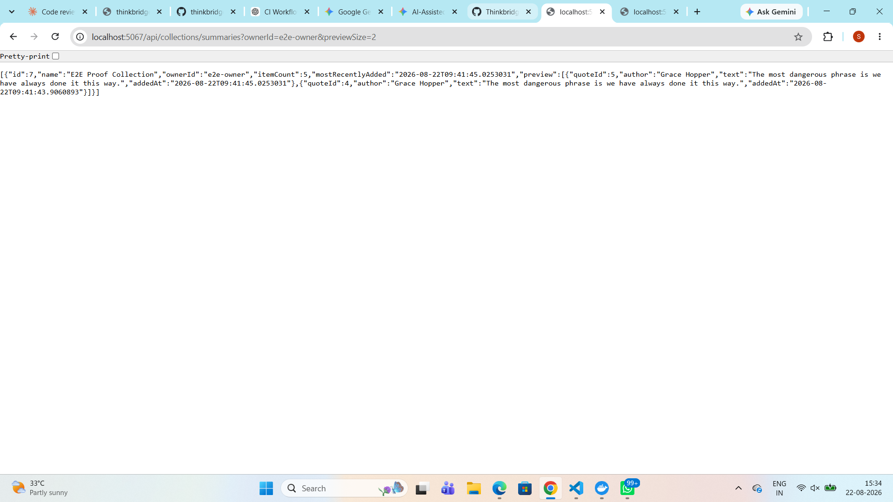
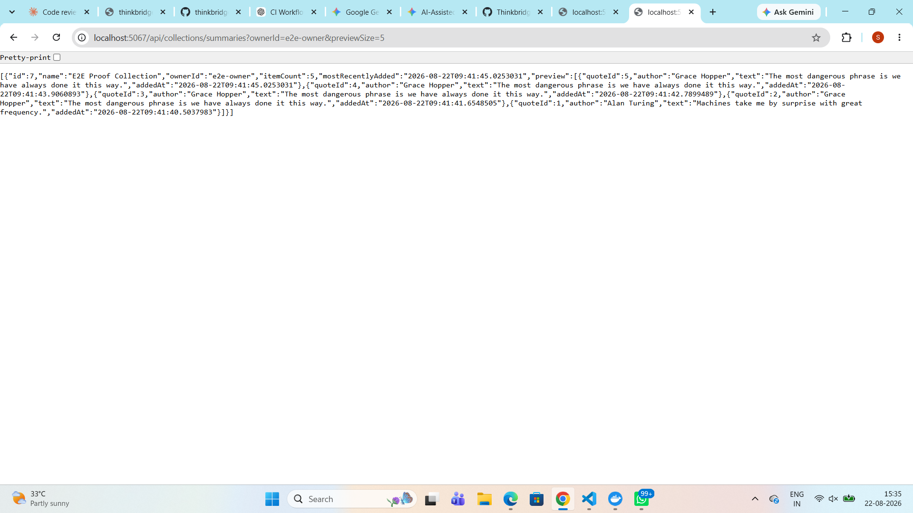

# Day 12 — Runtime evidence for the Collections read path

Captured against a locally running API (`http://localhost:5067`, Development,
EF Core SQL logging on) at commit b1f26bc.

## Setup

    POST /api/collections  {"name":"E2E Proof Collection","ownerId":"e2e-owner"}
      -> 201 Created, {"id":7}

    POST /api/collections/7/items/{1..5}   (one second apart, so AddedAt differs)
      -> 204 No Content x5

## The request under test

`GET /api/collections/summaries?ownerId=e2e-owner&previewSize=2` -> 200 OK

Preview holds 2 items; `itemCount` reports 5. The preview is capped, the count is not.

## Browser responses





Same collection in both. `itemCount` stays 5 while the preview grows from 2 items
to 5, ordered newest-first — so `previewSize` controls only the preview, and the
count reflects the whole collection either way.

## The generated SQL — the part that actually proves it

The JSON above cannot distinguish a server-side limit from an in-memory trim: the
original buggy version would have returned exactly the same response. Only the
generated SQL settles it.

```sql
SELECT "c"."Id", "c"."Name", "c"."OwnerId", (
    SELECT COUNT(*)
    FROM "CollectionItem" AS "c0"
    WHERE "c"."Id" = "c0"."CollectionId"), CASE
    WHEN (
        SELECT COUNT(*)
        FROM "CollectionItem" AS "c1"
        WHERE "c"."Id" = "c1"."CollectionId") = 0 THEN NULL
    ELSE (
        SELECT MAX("c2"."AddedAt")
        FROM "CollectionItem" AS "c2"
        WHERE "c"."Id" = "c2"."CollectionId")
END, "c5"."QuoteId", "c5"."AddedAt", "c5"."Id"
FROM "Collections" AS "c"
LEFT JOIN (
    SELECT "c4"."QuoteId", "c4"."AddedAt", "c4"."Id", "c4"."CollectionId"
    FROM (
        SELECT "c3"."QuoteId", "c3"."AddedAt", "c3"."Id", "c3"."CollectionId", ROW_NUMBER() OVER(PARTITION BY "c3"."CollectionId" ORDER BY "c3"."AddedAt" DESC) AS "row"
        FROM "CollectionItem" AS "c3"
    ) AS "c4"
    WHERE "c4"."row" <= @request_PreviewSize
) AS "c5" ON "c"."Id" = "c5"."CollectionId"
WHERE "c"."OwnerId" = @request_OwnerId
ORDER BY "c"."Id", "c5"."CollectionId", "c5"."AddedAt" DESC
```

`ROW_NUMBER()` partitioned by `CollectionId`, filtered by `row <= @request_PreviewSize`
— the limit is applied per collection in the database. The `COUNT` and `MAX`
subqueries carry no row filter, which is what proves `itemCount` and
`mostRecentlyAdded` still cover the whole collection.

Second statement, also verbatim from the log:

```sql
SELECT "q"."Id", "q"."Author", "q"."Text"
FROM "Quotes" AS "q"
WHERE "q"."Id" IN (@quoteIds1, @quoteIds2)
```

Only the two previewed quotes are fetched. Two SQL statements for the request,
regardless of how many collections match.

## Caveat

The test data cannot distinguish "MAX over all 5" from "MAX over the 2 previewed"
by value, because the newest item happens to be in both sets. That distinction is
settled by the SQL above, not by the JSON.
