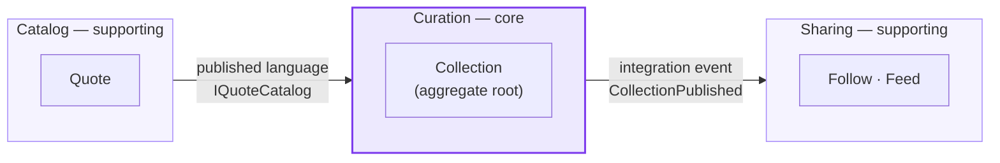
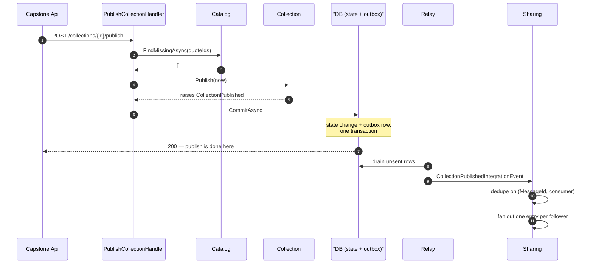

[← Back to the day index](../Days/README.md)

# Capstone — Curated collections, published to followers

**The slice.** A curator assembles a collection of quotes, publishes it, and
their followers see it appear in their feed. One user-visible outcome, narrow
enough to build, wide enough to need three bounded contexts, a real aggregate,
and an asynchronous flow that must survive one half of it being down.

It is a slice of a product this repository already half-has: `QuotesApi` has
quotes and a `Collection` aggregate, and Days 19–22 built the outbox, the
Service Bus topic, the relay and the resilience pipeline that publishing needs.
What it does not have is a structure that keeps those pieces from growing into
each other, which is what this capstone is for.

---

## Bounded contexts



| Context | Owns | Why it is separate |
|---|---|---|
| **Curation** *(core)* | `Collection`, its items, the publish lifecycle | This is the product. It is the only context whose rules are worth arguing about, and the only one modelled as a rich aggregate. |
| **Catalog** *(supporting)* | Quotes: author, text, deletion | Quotes change for entirely different reasons than collections do, and are read by things that have never heard of curation. Already built and tested in `QuotesApi`; the capstone consumes it rather than rebuilding it. |
| **Sharing** *(supporting)* | Follows, feeds | A feed is a read-optimised projection with its own scaling problem. Folding it into Curation would make one curator's follower count a factor in whether their publish succeeds. |

**Context map — the relationships, not just the boxes.**

- **Catalog → Curation is customer/supplier.** Catalog is upstream and does not
  change shape because Curation asked. Curation consumes it through
  `IQuoteCatalog`, a two-method published language, and holds `QuoteId` and
  never quote *text* — so a quote being edited is not an event Curation has to
  care about.
- **Curation → Sharing is publisher/subscriber**, and deliberately one-way.
  Curation does not know Sharing exists; it writes an integration event and is
  finished. A second subscriber — search indexing, notifications — is a new
  consumer of the same event and no change at all to Curation.

**Identity is not a context here.** Curator and follower are opaque strings the
host supplies from the existing JWT (Day 2/3). Promoting authentication to a
bounded context of its own would be modelling the infrastructure, not the
business.

---

## The core aggregate

[`Collection`](src/Modules/Curation/Capstone.Curation.Domain/Collection.cs) —
the consistency boundary, and the only thing the repository loads or saves.

| | |
|---|---|
| **Identity** | `CollectionId`, a `Guid` v7 **minted in the domain**, not by the database |
| **Inside the boundary** | The collection, its name, status, and its ordered items |
| **Outside** | Quotes (referenced by `QuoteId`), curators, followers, feeds |
| **Invariants** | name 3–80 chars after trimming · at most 50 items · no duplicate quote · at least one item before publishing · publish once · a published collection is frozen |
| **Raises** | `CollectionPublished` |

**Two decisions worth defending.**

*Identity is generated in the domain.* The existing `Collection` uses a
database-generated `int`, so an aggregate has no identity until it is saved —
which is precisely why Day 20's outbox write needed **two** `SaveChangesAsync`
calls: one to get the id, another to write the outbox row that needed it. A
domain-minted id removes the ordering constraint and collapses that back into
one transaction. Version 7 rather than random, so inserts stay at the end of
the index instead of scattering page splits across it — Day 8's reasoning
applied to the key itself.

*Publishing freezes the collection.* Edits require unpublishing first. This has
a real cost — fixing a typo briefly withdraws the collection from feeds — and
the better answer is versioning, where publish takes an immutable snapshot and
the draft stays editable. Freezing is the honest interim: it stops "what
followers saw" and "what the curator has" from silently diverging, which is the
divergence that would be hardest to unpick later.

**What the aggregate deliberately cannot check.** Whether the referenced quotes
still exist is a question only Catalog can answer, and an aggregate that made
that call would be doing I/O inside an invariant and would need a network to
unit-test. That check lives in
[`PublishCollectionHandler`](src/Modules/Curation/Capstone.Curation.Application/PublishCollection/PublishCollectionCommand.cs),
before `Publish` is called. The rule: **an aggregate enforces what it can see;
anything needing another context's data is a use-case concern.**

---

## The async flows



**The commit is the boundary of the promise.** The curator's request returns
once the state change and the outbox row are committed together. Everything
after that is catch-up. Publishing inside the transaction instead would tie one
curator's publish latency to their follower count and fail the publish outright
when the feed store is unavailable — for a feed, clearly the wrong trade.

**Why an outbox and not a publish call.** A publish after the commit can be
lost; a publish before it can announce something that then rolls back. Only a
row written *inside* the transaction is safe. That is Day 20's lesson, and it is
why there is no publisher port in the application layer at all — if one existed,
somebody would eventually call it after `SaveChangesAsync`, and the gap between
those two lines is where messages go missing.

**Delivery is at-least-once, so every subscriber deduplicates.** The
`MessageId` is minted when the outbox row is written and travels unchanged;
Sharing keys on `(MessageId, consumer)` so two different subscribers each
process the same message exactly once. Without it, a relay retry puts a second
copy of the same collection in every follower's feed — a bug that looks like a
UI glitch and is actually a missing idempotency key.

**Fan-out on write, and where that stops working.** One feed row per follower is
right at hundreds of followers and wrong at millions; the standard fix is to
exclude popular curators from fan-out and merge them in at read time. Not built.
The reason it stays cheap to build later is that the fan-out is a handler behind
an interface, not a trigger or a join.

**Translation at the boundary.** The domain event and the integration event are
separate types, and
[`DomainEventTranslator`](src/Modules/Curation/Capstone.Curation.Infrastructure/Outbox/DomainEventTranslator.cs)
is the only place that knows both. Publishing the domain event directly would
weld Curation's internal model to every subscriber's contract, and the first
refactor of the aggregate would silently be a breaking change. Here it is a
compile error in one file.

---

## Solution layout

```
capstone/
├─ src/
│  ├─ Capstone.SharedKernel/              AggregateRoot, IDomainEvent, DomainException
│  ├─ Modules/
│  │  ├─ Catalog/
│  │  │  ├─ Capstone.Catalog.Contracts/         IQuoteCatalog, QuoteSummary
│  │  │  └─ Capstone.Catalog.Infrastructure/    adapter (stub → existing quote tables)
│  │  ├─ Curation/
│  │  │  ├─ Capstone.Curation.Contracts/        CollectionPublishedIntegrationEvent
│  │  │  ├─ Capstone.Curation.Domain/           Collection, ids, domain events
│  │  │  ├─ Capstone.Curation.Application/      PublishCollection, ports
│  │  │  └─ Capstone.Curation.Infrastructure/   repository, unit of work, outbox
│  │  └─ Sharing/
│  │     ├─ Capstone.Sharing.Application/       fan-out handler, ports
│  │     └─ Capstone.Sharing.Infrastructure/    feed / follow / dedup stores
│  └─ Capstone.Api/                       composition root + in-process relay
└─ tests/
   ├─ Capstone.Curation.Domain.Tests/     the aggregate's rules
   └─ Capstone.ArchitectureTests/         the boundaries, enforced
```

**The dependency rule, and why it is a test and not a convention.** `QuotesApi`
is layered by *folder* inside one assembly — nothing there stops `Domain` from
referencing `Data` except that nobody has done it yet. Here the layers are
assemblies, so the compiler enforces direction, and
[`ModuleBoundaries`](tests/Capstone.ArchitectureTests/ModuleBoundaries.cs)
writes the permitted graph down once:

- `*.Domain` references the shared kernel and nothing else — no EF, no ASP.NET,
  no other module.
- `*.Application` references its own domain plus other modules' **Contracts**.
- No module references another module's `Infrastructure`.
- **Only `Capstone.Api` references any `Infrastructure`** — somebody has to bolt
  the modules together, and it should be exactly one somebody.
- A `Contracts` project references no capstone assembly at all, so subscribing
  to a module never means compiling against it.

Two tests enforce this, because either alone leaves a gap: one reads the
`.csproj` files (catching a reference declared before the code that uses it),
one reads `GetReferencedAssemblies()` on the compiled output (catching a
dependency arriving by a route the project file does not obviously show). Adding
a reference outside the table fails CI, so widening the graph becomes a decision
someone makes on purpose.

A module gets a `Contracts` project when a second module needs one — not from a
template. Sharing has none, because nothing consumes Sharing yet.

---

## What is real, and what is scaffolding

| Real | Scaffolded |
|---|---|
| The `Collection` aggregate and every invariant, unit-tested | Persistence — in-memory; EF mapping is the next piece |
| The publish use case, including the cross-context check | `IQuoteCatalog` — a seeded dictionary, not the real quote tables |
| Domain-event → integration-event translation | Feed, follows and dedup stores — dictionaries |
| The module boundaries, enforced by CI | The relay — in-process and called inline, standing in for Day 20's separate relay + Service Bus |

The split is deliberate: Catalog's behaviour is already proven by 54 integration
tests in the main solution, so a stub there costs nothing. Curation's is not
proven anywhere, which is why it is real code with real tests.

**Deferred on purpose, with the decision already made:** EF mapping
(`Collection` as the entity, `Items` owned, ids through value converters);
read-side projections (the Dapper split from Day 12, not this repository);
authorisation beyond ownership; and collection versioning, which is what
eventually replaces the freeze-on-publish rule above.

---

## Verification status

All twelve projects build clean. `Capstone.Curation.Domain.Tests` passes 20/20
and `Capstone.ArchitectureTests` passes 6/6.

**The boundary tests were checked against a real violation, not just observed
passing.** A rule that has only ever been green is a rule nobody has proven can
fail. So a reference from `Capstone.Curation.Domain` to
`Capstone.Catalog.Contracts` — forbidden, the domain may see the shared kernel
and nothing else — was added deliberately. It compiles fine, because it is not
a cycle and nothing uses it, which is exactly the case the `.csproj`-reading
test exists to catch and the compiled-reference test cannot see. Exactly one of
the six tests failed, naming the violation; the reference was then removed and
the suite went back to 6/6.

That is the difference between a dependency rule and a dependency diagram. This
one has been observed stopping something.

## Running it

```bash
dotnet test capstone/tests/Capstone.Curation.Domain.Tests
dotnet test capstone/tests/Capstone.ArchitectureTests
dotnet run --project capstone/src/Capstone.Api
```

The API is walkable end to end in one process — create a collection, add
quotes 1–3, follow the curator, publish, read the feed — which is the point of
the in-process relay: the seam it will be replaced at is visible in code rather
than described in a document.
